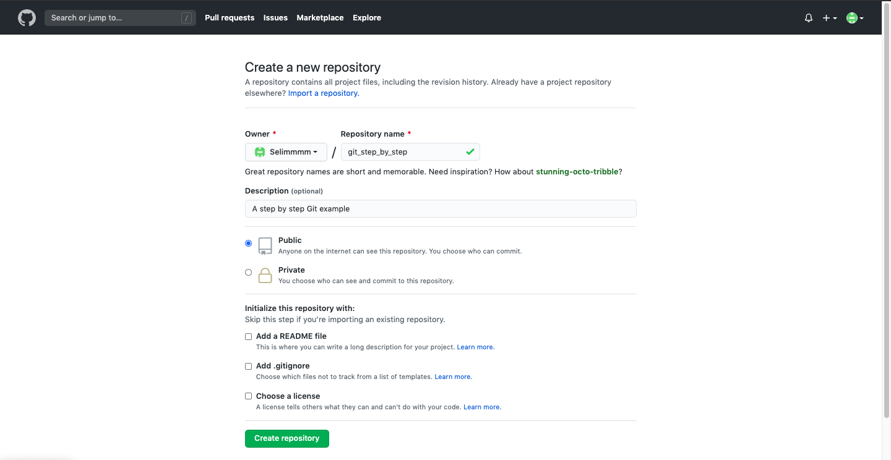
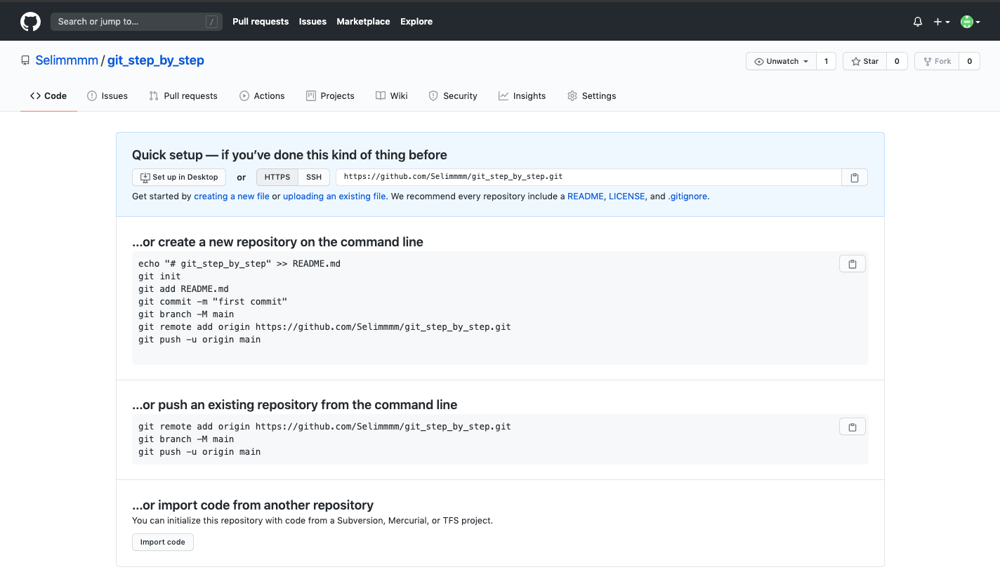

# Tutoriel Git étape par étape

## Créer un repository distant (remote) sur GitHub

- Après s'être inscrit sur Github ([Lien](https://github.com/join?source=login)), se connecter et se rendre sur [la page pour créer un nouveau repository](https://github.com/new)



- On arrive sur cette page




## Créer un repository en local

- Aller dans le dossier choisi avec le terminal (sur Linux / Mac OS) ou avec Git Bash (Windows) :

```bash
cd git_step_by_step/ 
```

- Initialiser le repository local : 

```bash
cd git init
```


## Faire un premier commit en local

- Créer un fichier texte "file_1.txt", par exemple en tapant :

```bash
touch file_1.txt
open file_1.txt # le fichier va s'ouvrir, écrire quelque chose et enregistrer
```


- Vérifier ce qu'on a modifié

```bash
git status # vérifier ce qu'on a modifié
```

- Ajouter les modifications faites (c'est dire à Git ce qu'on va sauvegarder dans l'étape d'après). Il faut avoir enregistré à l'étape d'avant ! 

```bash
git status # vérifier ce qu'on a modifié
git add file_1.txt 
```

- Commit (c'est faire une photo de notre dossier en ne photographiant que ce qu'on a ajouté dans l'étape d'avant)

```bash
git commit -m "file_1.txt créé, on a écrit dedans"
```


## Pousser sur le repository remote pour la première fois

- Ajouter l'URL de la branche en remote (origin)

```bash
git remote add origin https://github.com/Selimmmm/git_step_by_step.git

```


- "Brancher" notre branche master (en local) sur la branche origin (en remote)


```bash
git push --set-upstream origin master

```


- Aller sur la page de repository pour voir les modifications en ligne : [https://github.com/Selimmmm/git_step_by_step](https://github.com/Selimmmm/git_step_by_step) (ou https://github.com/username/name_of_repository)


## Routine status / add / commit / push

- Ajouter une ligne dans file_1.txt et y écrire quelque chose, et créer et écrire dans file_2.txt
```bash
open file_1.txt # le fichier va s'ouvrir, écrire quelque chose et enregistrer

touch file_2.txt
open file_2.txt # le fichier va s'ouvrir, écrire quelque chose et enregistrer
```